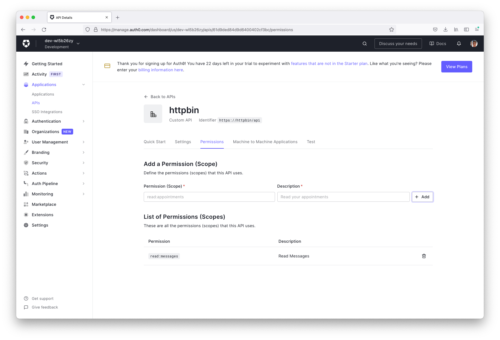

# Istio authN/Z with JWT

Table of contents
=================
* [Installation](#installation)
    * [Cluster](#install-cluster)
    * [Istio](#install-istio)
    * [Application](#install-application)
* [Setup Auth0](#setup-auth0)
* [Test](#test)
* [Cleanup](#cleanup)

Installation
============
We will install Istio, Istio-Ingressgateway into a local cluster created by [K3d](https://k3d.io). For the demo purpose we'll also need to install [httpbin service](https://github.com/istio/istio/blob/master/samples/httpbin/httpbin.yaml).

Install Cluster
===============
```
$ ./installation/install-cluster.zsh
...
```

Install Istio
=============
Setup the Istio version
```
$
export ISTIO_VERSION=1.14.1
export ISTIO_VERSION_TAG=1.14.1-distroless
export ISTIO_REVISION=1-14-1
```
Install Istiod
```
$ ./installation/install-istio.zsh
...
```
Install Istio-Ingressgateway
```
$ ./installation/install-gateway.zsh
...
```

Make `default` namespace Istio sidecar auto-injection.
```
$ kubectl label namespace default istio.io/rev=$ISTIO_REVISION --overwrite
```

Install Application
===================
```
% kubectl apply -f https://raw.githubusercontent.com/istio/istio/release-1.14/samples/httpbin/httpbin.yaml
serviceaccount/httpbin created
service/httpbin created
deployment.apps/httpbin created
```

Install Istio Gateway, VirtualService, PeerAuthentication, RequestAuthentication, AuthorizationPolicy.
```
$ kubectl apply -k ./
gateway.networking.istio.io/httpbin-gateway created
virtualservice.networking.istio.io/httpbin created
authorizationpolicy.security.istio.io/require-jwt-httpbin created
authorizationpolicy.security.istio.io/deny-jwt-gw created
authorizationpolicy.security.istio.io/deny-by-default created
peerauthentication.security.istio.io/default created
requestauthentication.security.istio.io/jwt-authn-httpbin created
requestauthentication.security.istio.io/jwt-authn-gw created
```

Setup Auth0
===========
Signin Auth0 (with a free account), and create an API.

1. Create an API with Name as httpbin, and Identifier https://httpbin/api


2. Grant permission for this API as read:messages


3. Enable permission


4. Get Access Token for the API
```
$ CLIENT_ID=<client_id>
$ CLIENT_SECRET=<client_secret>

$ TOKEN=$(curl --request POST \
  --url https://dev-wl5b26zy.us.auth0.com/oauth/token \
  --header 'content-type: application/json' \
  --data '{"client_id":"'"$CLIENT_ID"'","client_secret":"'"$CLIENT_SECRET"'","audience":"https://httpbin/api","grant_type":"client_credentials"}' | jq -r .access_token)
```

Test
====
Check AuthorizationPolicy:
```
$ istioctl x authz check deploy/httpbin                                      
ACTION   AuthorizationPolicy           RULES
ALLOW    require-jwt-httpbin.default   1
ALLOW    _anonymous_match_nothing_     1

$ istioctl x authz check deploy/istio-ingressgateway-1-14-1 -n istio-gateway
ACTION   AuthorizationPolicy         RULES
DENY     deny-jwt-gw.istio-gateway   1
```

Success Req:
```
$ curl -i -H "Authorization:Bearer ${TOKEN}" http://localhost:8080/status/200
HTTP/1.1 200 OK
server: istio-envoy
date: Fri, 22 Jul 2022 17:35:45 GMT
content-type: text/html; charset=utf-8
access-control-allow-origin: *
access-control-allow-credentials: true
content-length: 0
x-envoy-upstream-service-time: 2
```

Failure Req:
```
$ curl -i http://localhost:8080/status/200
HTTP/1.1 403 Forbidden
content-length: 19
content-type: text/plain
date: Fri, 22 Jul 2022 18:17:08 GMT
server: istio-envoy

RBAC: access denied
```

Failure Req:
```
$ curl -i -H "Authorization:Bearer unknown" http://localhost:8080/status/200
HTTP/1.1 401 Unauthorized
www-authenticate: Bearer realm="http://localhost:8080/status/200", error="invalid_token"
content-length: 79
content-type: text/plain
date: Fri, 22 Jul 2022 18:17:43 GMT
server: istio-envoy

Jwt is not in the form of Header.Payload.Signature with two dots and 3 sections
```

Cleanup
=======
```
$ ./installation/cleanup.zsh
...
```